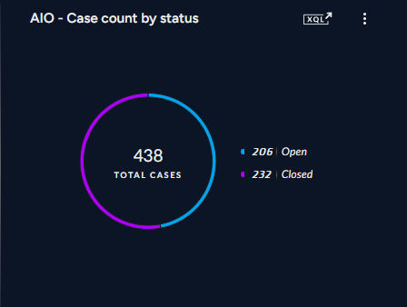

# Incident count by Status (24 hours)



## XQL Query
```bash
dataset = incidents
| filter timestamp_diff(current_time(), creation_time, "SECOND") <= 86400
| alter case_state = if(
    status in (
        ENUM.RESOLVED,
        ENUM.RESOLVED_AUTO_RESOLVE,
        ENUM.RESOLVED_FALSE_POSITIVE,
        ENUM.RESOLVED_TRUE_POSITIVE,
        ENUM.RESOLVED_SECURITY_TESTING,
        ENUM.RESOLVED_OTHER,
        ENUM.RESOLVED_KNOWN_ISSUE,
        ENUM.RESOLVED_DUPLICATE_INCIDENT,
        ENUM.RESOLVED_HANDLED_THREAT
    ), "Closed", "Open"
)
| comp count_distinct(incident_id) as case_count by case_state
| view graph type = pie xaxis = case_state yaxis = case_count seriestitle("case_count","Total cases") 
```
